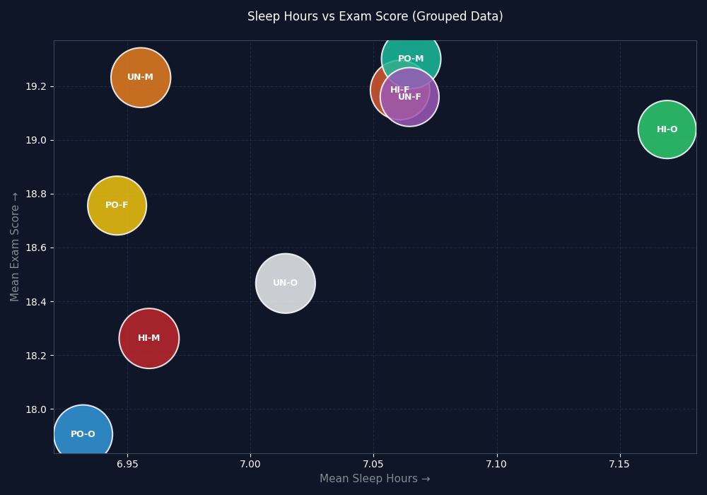

# Data-Science-with-Python
# Student Productivity & Performance Analysis

This project explores the relationship between study habits, sleep patterns, and academic performance using a dataset of 5,000 students.

#The Visualization
The primary goal of this analysis was to see how study hours and sleep hours impact exam scores.

# Built With
* Python 3
* Pandas: For data manipulation and grouping.
* Matplotlib/Seaborn: For creating the dark-themed scatter visualizations.

# 📁 Project Structure
* `Student Scenario_1.py`: The main Python script that processes data and generates charts.
* `my_analysis_plot.png`: The resulting visualization.
* `ultimate_student_productivity_dataset_5000.csv`: The raw dataset used for analysis.

